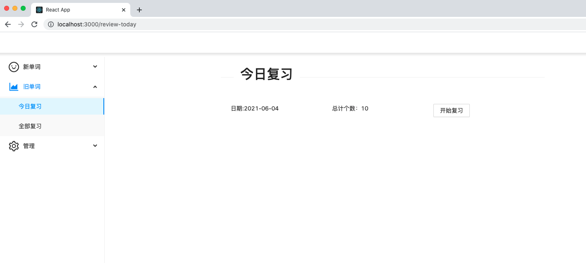

# 一款自用的学习英语的App

之前做了一款基于 <b style="color:#41B883">Vue</b> 的英语学习app，仅仅只有英文单词、中文解释、英语发音的功能，并且界面没使用UI库，比较简洁；

这次，基于<b style="color:#0F78FF">Typescript</b> + **react** + <b style="color:#23BDFF">antDesign</b> 重新设计了前端页面，并且添加了许多功能，除了之前vue的功能外，增加的功能有
> + 对vocabulary网站数据的爬取，并存进数据库
> + 对bing网站爬取的数据更加精细的拆分获取，并存进数据库
> + 对单词的管理

# 系统模块设计
## 一、学习模块
### 1.1 对新单词的学习
可以有选择的根据自己的情况学习单词并存档。

### 1.2 vocabulary词典
将鼠标悬浮至单词上，会从数据库获取vocabulary词典相关数据，如果没有，将会自动爬取vocabulary并存进数据库。

### 1.3 中文释义
此数据自己获取并存放数据库，可以去网上找，我找的是考研单词5500。

### 1.4 单词发音
悬浮发音按钮，会自动播放发音功能，该功能是自动判断数据库有没有数据，没有便会自动获取单词相关发音并下载至服务器。

## 二、复习模块
### 2.1 今日复习
该模块根据艾宾浩斯曲线，自动计算日期得到今日该复习的单词。

### 2.2 所有复习
展示所有复习模块，自主学习

## 三、管理模块
管理单词、bing、vocabulary等数据库数据。